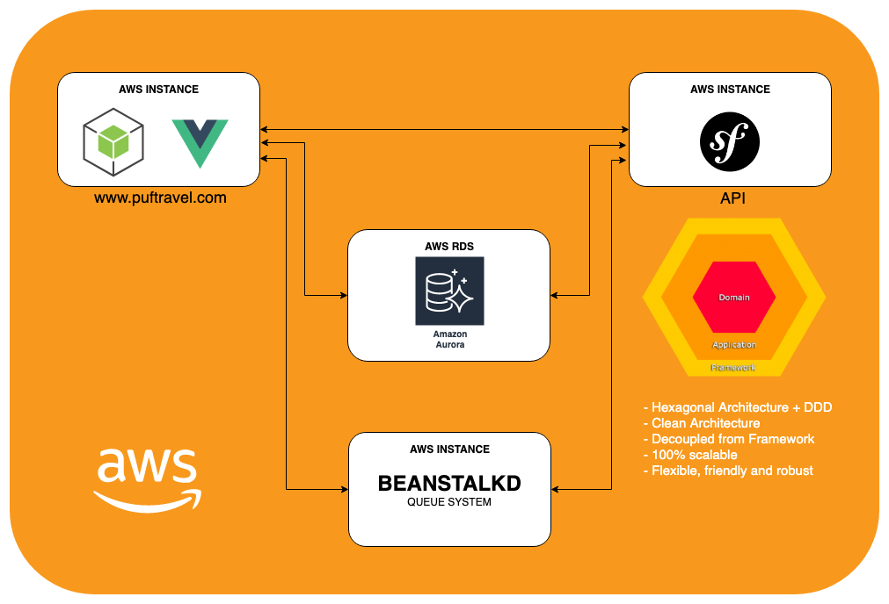

# Plataforma Propuesta para PUF Travel
Actualmente se conforma por dos principales proyectos, un proyecto para toda la interfaz WEB y otro para el API. Procederemos a detallar de cada uno lo siguiente:

<i class="fa fa-network-wired"></i> Tecnología (Technology) 
<i class="fab fa-symfony"></i> Framework 
<i class="fa fa-hand-peace"></i> Buenas prácticas (Best Practices) 
<i class="fa fa-code"></i> Coding Style  
<i class="fa fa-swatchbook"></i> Patrones de Diseño (Design Patterns) 
<i class="fa fa-box-open"></i> Arquitectura de Software (Software Architecture) 
<i class="fa fa-project-diagram"></i> Infraestructura (Infrastructure) 
<i class="fab fa-git"></i> Git Flow Development (Flujo de Desarrollo GIT)

 

### WEB

#### Tecnologías:
- **Lenguaje:** PHP 7.3.x
- **Base de Datos:** MySQL 5.7
- **Sistema de Colas:** Beanstalkd
- **Cache:** Memcached
- **Frontend:** Vue.js, Stylus, CSS

#### Framework:
- NodeJS + Vue.js

### Buenas Prácticas:
- Vue.js implementa muy buenas prácticas a la hora de estructurar los directorios.
- Vue.js implementa buenas prácticas en cuanto a el uso de stores, routing y más.
- DRY (Don't Repeat Yourself), evitar duplicidad de codigo.
- KISS (Keep It Simple Stupid), evitar hacer código espaguetti para cosas tan sencillas que pueden hacerce en unas pocas lineas de código. 

### Coding Style:
- Correcta identación del codigo.
- Cero comentarios donde el codigo es mas que tácito para cualquier programador.
- Evitar dejar codigo comentado que no se utiliza.

### Patrones de Diseño (Design Patterns):
- Se utilizan los por defecto del Framework.

### Arquitectura de Software (Software Architecture):
- Se utiliza la por defecto del Framework.

### Infraestructura (Infrastructure):
- Se utiliza una instancia de AWS para el despliegue del proyecto.

### Git Flow Development (Flujo de Desarrollo GIT):
- Ninguno, no se implementa en lo absoluto un GIT Flow para garantizar consistencia en los repositorios de código y sobre todo brindar seguridad en cada release y poder facilmente hacer reverts en producción. No hay control de versiones en el código.

 
### API

#### Tecnologías:
- **Lenguaje:** PHP 7.3.x
- **Base de Datos:** MySQL 5.7
- **Sistema de Colas:** Beanstalkd
- **Cache:** Memcached

#### Framework:
- Symfony 4

### Buenas Prácticas:
- Las sugeridas por Symfony en su versión 4.0 en cuanto a convención de nombres, directorios, formularios  entre otros.
- DRY (Don't Repeat Yourself), evitar duplicidad de codigo.
- KISS (Keep It Simple Stupid), evitar hacer código espaguetti para cosas tan sencillas que pueden hacerce en unas pocas lineas de código.

### Coding Style:
- Por defecto Symfony implementa los estándares PSR-1, PSR-2 y PSR-4

### Patrones de Diseño (Design Patterns):
- Aplicar los 5 principios de SOLID.
- Facade
- Factory Method
- Port and Adapters

### Arquitectura de Software (Software Architecture):
- Hexagonal Architecture
- Domain Driven Design (DDD)
- CQRS (Command Query Responsability Segregation)

### Infraestructura (Infrastructure):
- Se utiliza una instancia de AWS para el despliegue del proyecto.

### Git Flow Development (Flujo de Desarrollo GIT):
- Rama **master** para producción
- Rama **staging** para Testing
- Rama **dev** para Desarrollo
- Cada funcionalidad se debe implementar desde una rama nueva la cual debe partir de la rama **dev**.
- Al finalizar una funcionalidad se debe hacer Pull Request (PR) sobre la rama **dev**
- Cuando se va a pasar a **producción** se debe hacer un release versión con la cognotación vX.X.X, ejemplo: v1.0.0
- Los hotfix van sobre la rama **master**
- La rama staging contiene todo lo de **master** mas lo nuevo que se va a integrar desde **dev**, solo se usar para levantar entornos de prueba

### Diagrama de Git Flow

  

### Diagrama de la Infrastructura y Arquitectura de Software Propuesta
 
